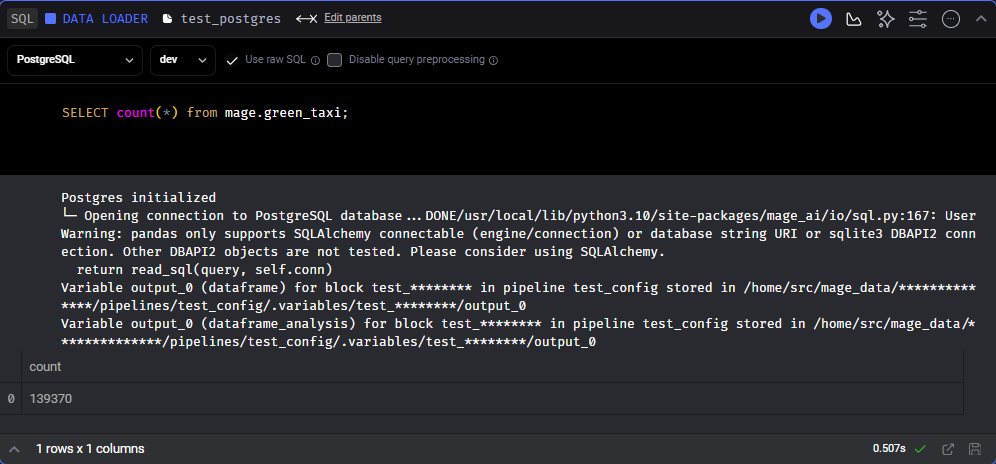

* In case you don't get one option exactly, select the closest one

For the homework, we'll be working with the green taxi dataset located here:

[dataset](https://github.com/DataTalksClub/nyc-tlc-data/releases/download/green/green_tripdata_2020-{month}.csv.gz)

## **Assignment**
* The goal will be to construct an ETL pipeline that loads the data, performs some transformations, and writes the data to a database (and Google Cloud!).

* Create a new pipeline, call it green_taxi_etl
* Add a data loader block and use Pandas to read data for the final quarter of 2020 (months 10, 11, 12).
* You can use the same datatypes and date parsing methods shown in the course.  
* _BONUS: load the final three months using a for loop and pd.concat_

* Add a transformer block and perform the following:  
  * Remove rows where the passenger count is equal to 0 or the trip distance is equal to zero.
  * Create a new column lpep_pickup_date by converting lpep_pickup_datetime to a date.
  * Rename columns in Camel Case to Snake Case, e.g. VendorID to vendor_id.
* Add three assertions:
  * vendor_id is one of the existing values in the column (currently)
  * passenger_count is greater than 0
  * trip_distance is greater than 0

* Using a Postgres data exporter (SQL or Python), write the dataset to a table called green_taxi in a schema mage. Replace the table if it already exists.
  

* Write your data as Parquet files to a bucket in GCP, partioned by lpep_pickup_date. Use the pyarrow library!
  

* Schedule your pipeline to run daily at 5AM UTC.

## **Questions**
* **Question 1. Data Loading**
  * Once the dataset is loaded, what's the shape of the data?
    * **266,855 rows x 20 columns**

* **Question 2. Data Transformation**
  * Upon filtering the dataset where the passenger count is greater than 0 and the trip distance is greater than zero, how many rows are left?
    * **139,370 rows**

* **Question 3. Data Transformation**
  * Which of the following creates a new column lpep_pickup_date by converting lpep_pickup_datetime to a date?
    * **data['lpep_pickup_date'] = data['lpep_pickup_datetime'].dt.date** -->For me this didn't work in python tranformer block within mage(But worked when tried in Jupyter Notebook in local instance. In green_taxi_etl I used data['lpep_pickup_date2'] = data['lpep_pickup_datetime'].dt.strftime("%Y/%m/%d"))

* **Question 4. Data Transformation**
  * What are the existing values of VendorID in the dataset?
    * **1 or 2**
  
  

* **Question 5. Data Transformation**
  * How many columns need to be renamed to snake case?
    * **4**

* **Question 6. Data Exporting**
  * Once exported, how many partitions (folders) are present in Google Cloud?
    * 95
